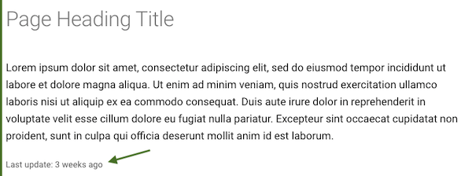

# mkdocs-git-revision-date-localized-plugin

[MkDocs](https://www.mkdocs.org/) plugin that enables displaying the localized date of the last git modification of a markdown file. Forked from [mkdocs-git-revision-date-plugin](https://github.com/zhaoterryy/mkdocs-git-revision-date-plugin).



(*Example when used together with [mkdocs-material](https://github.com/squidfunk/mkdocs-material) theme*)

## Setup

Install the plugin using pip:

```bash
pip install mkdocs-git-revision-date-localized-plugin
```

Activate the plugin in `mkdocs.yml`:

```yaml
plugins:
  - git-revision-date-localized
```

## Usage

### In theme templates

In templates you can use `page.meta.git_revision_date_localized`:

```django hljs

  Last update: {{ page.meta.git_revision_date_localized }}

```

### In markdown pages

In your markdown files you can use `{{ git_revision_date_localized }}`:

```django hljs
Last update: {{ git_revision_date_localized }}
```

## Localizated variants

The plugin uses [babel](https://github.com/python-babel/babel/tree/master/babel) and [timeago](https://github.com/hustcc/timeago) to provide different date formats:

```django hljs
{{ git_revision_date_localized }}
{{ git_revision_date_localized_time }}
{{ git_revision_date_localized_iso }}
{{ git_revision_date_localized_iso_time }}
{{ git_revision_date_localized_timeago }}
```

Output:

```
28 November, 2019
28 November, 2019 13:57:28
2019-11-28
2019-11-28 13:57:26
20 hours ago
```

## Options

### `locale`

Set this option to a two letter [ISO639](https://en.wikipedia.org/wiki/List_of_ISO_639-1_codes) language code to use a another language. This will overwrite any locale setting in `mkdocs` or your theme. If no locale is set fallback is English (`en`).
