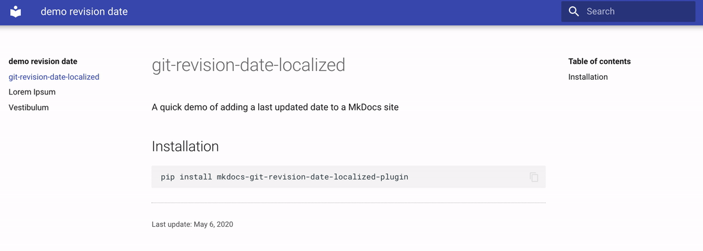

[](https://github.com/timvink/mkdocs-git-revision-date-localized-plugin/actions)


[](https://codecov.io/gh/timvink/mkdocs-git-revision-date-localized-plugin)


# mkdocs-git-revision-date-localized-plugin

[MkDocs](https://www.mkdocs.org/) plugin that enables displaying the date of the last git modification of a page. The plugin uses [babel](https://github.com/python-babel/babel/tree/master/babel) and [timeago.js](https://github.com/hustcc/timeago.js) to provide different localized date formats. Initial fork from [mkdocs-git-revision-date-plugin](https://github.com/zhaoterryy/mkdocs-git-revision-date-plugin).



(*Example when used together with the [mkdocs-material](https://github.com/squidfunk/mkdocs-material) theme*)

## Setup

Install the plugin using `pip3` with the following command:

```bash
pip3 install mkdocs-git-revision-date-localized-plugin
```

Next, add the following lines to your `mkdocs.yml`:

```yaml
plugins:
  - search
  - git-revision-date-localized
```

> If you have no `plugins` entry in your config file yet, you'll likely also want to add the `search` plugin. MkDocs enables it by default if there is no `plugins` entry set.

### Note when using build environments

This plugin needs access to the last commit that touched a specific file to be able to retrieve the date. By default many build environments only retrieve the last commit, which means you might need to:
<details>
  <summary>Change your CI settings</summary>
  
  - github actions: set `fetch_depth` to `0` ([docs](https://github.com/actions/checkout))
  - gitlab runners: set `GIT_DEPTH` to `1000` ([docs](https://docs.gitlab.com/ee/user/project/pipelines/settings.html#git-shallow-clone))
  - bitbucket pipelines: set `clone: depth: full` ([docs](https://support.atlassian.com/bitbucket-cloud/docs/configure-bitbucket-pipelinesyml/))
</details>


## Usage

### In supported themes

- [mkdocs-material](https://squidfunk.github.io/mkdocs-material/) offers native support for this plugin, see [setup instructions](https://squidfunk.github.io/mkdocs-material/plugins/revision-date/)

### In markdown pages

In your markdown files you can use the `{{ git_revision_date_localized }}` tag anywhere you'd like:

```django hljs
Last update: {{ git_revision_date_localized }}
```

### Extending existing themes

You can [customize an existing theme](https://www.mkdocs.org/user-guide/styling-your-docs/#customizing-a-theme) by overriding blocks or partials and using the `page.meta.git_revision_date_localized` tag.

To add a revision date to the default `mkdocs` theme by adding a `overrides/partials` folder to your `docs` folder and updating your `mkdocs.yml` file:

```yml
theme:
    name: mkdocs
    custom_dir: docs/overrides
```

And then adding a new file `docs/overrides/content.html` with the following content:

<details>
  <summary>content.html</summary>
  
  ```html
  <!-- Overwrites content.html base mkdocs theme, taken from 
  https://github.com/mkdocs/mkdocs/blob/master/mkdocs/themes/mkdocs/content.html -->

  
      <div class="source-links">
      
          <span class="label label-primary">{{ filename }}</span>
      
      </div>
  

  {{ page.content }}

  
      <small>Last update: {{ page.meta.git_revision_date_localized }}</small>
  
  ```
</details>

&nbsp;

### In custom themes

When writing your own [custom themes](https://www.mkdocs.org/user-guide/custom-themes/) you can use the `page.meta.git_revision_date_localized` jinja tag:

```django hljs

  Last update: {{ page.meta.git_revision_date_localized }}

```

You can style the output using CSS: the date outputs are always wrapped in `<span class='git-revision-date-localized-plugin git-revision-date-localized-plugin-{type}></span>` (where `{type}` is replaced with the `type` option set in the plugin).

## Options

You can customize the plugin by setting options in `mkdocs.yml`. For example:

```yml
plugins:
  - git-revision-date-localized:
      type: timeago
      time_zone: Europe/Amsterdam
      locale: en
      fallback_to_build_date: false
```

### `type`

Default is `date`. To change the date format, set the `type` parameter to one of `date`, `datetime`, `iso_date`, `iso_datetime` or `timeago`. Example outputs:

```bash
28 November, 2019           # type: date (default)
28 November, 2019 13:57:28  # type: datetime
2019-11-28                  # type: iso_date
2019-11-28 13:57:26         # type: iso_datetime
20 hours ago                # type: timeago
```

### `time_zone`

Default is `UTC`. Specify a time zone database name ([reference](https://en.wikipedia.org/wiki/List_of_tz_database_time_zones)). This option is especially relevant when using `type: datetime` and `type: iso_datetime`. Note that when using [timeago](http://timeago.yarp.com/) (with `type: timeago`) any difference in time zones between server and client will be handled automatically.

### `locale`

Default is `None`. Specify a two letter [ISO639](https://en.wikipedia.org/wiki/List_of_ISO_639-1_codes) language code to display dates in your preferred language.

- When not set, this plugin will look for `locale` or `language` options set in your theme. If also not set, the fallback is English (`en`)
- When used in combination with `type: date` or `type: datetime`, translation is done using [babel](https://github.com/python-babel/babel) which supports [these locales](http://www.unicode.org/cldr/charts/latest/supplemental/territory_language_information.html)
- When used in combination with `type: timeago` then [timeago.js](https://github.com/hustcc/timeago.js) is added to your website, which supports [these locales](https://github.com/hustcc/timeago.js/tree/master/src/lang). If you specify a locale not supported by timeago.js, the fallback is English (`en`)

### `fallback_to_build_date`

Default is `false`. If set to `true` the plugin will use the time at `mkdocs build` instead of the file's last git revision date *when git is not available*. This means the revision date can be incorrect, but this can be acceptable if you want your project to also successfully build in environments with no access to GIT.

## Contributing

Contributions are very welcome! Please read [CONTRIBUTING.md](CONTRIBUTING.md) before putting in any work.
